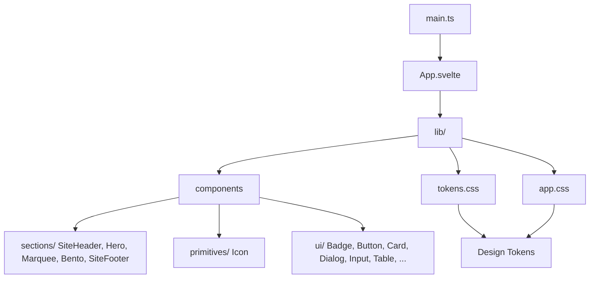

# EyuTaste

Svelte 5 design system for all Eyuel brand things. Premium monochrome, painted-wall canvas, sharp technical icons, engineered type.

## Architecture



```
src/
  App.svelte            page shell — composes the sections
  main.ts               entry
  lib/
    tokens.css          THE contract — every token in one file
    app.css             base styles + utilities
    data/
      landing.ts        landing content (icon row, ramp)
    components/
      sections/         page sections (SiteHeader, Hero, Marquee, Bento, SiteFooter)
      primitives/       near-zero-context atoms (Icon)
      ui/               single-purpose components (Badge, Button, Card, ...)
      brand/            owned identity (BrandMark)
```

## Rules

- **No duplicated styles.** One component, one file, one concern.
- **Tokens are the contract.** No hex/oklch outside `tokens.css`.
- **Composition, not inheritance.** Slots + snippets; thin, extensible components.
- **State in, callbacks out.** `Dialog` takes `open` + `onClose`.
- **Naming:** `block__element--modifier`.

## Quick start

```bash
npm install
npm run dev
```
