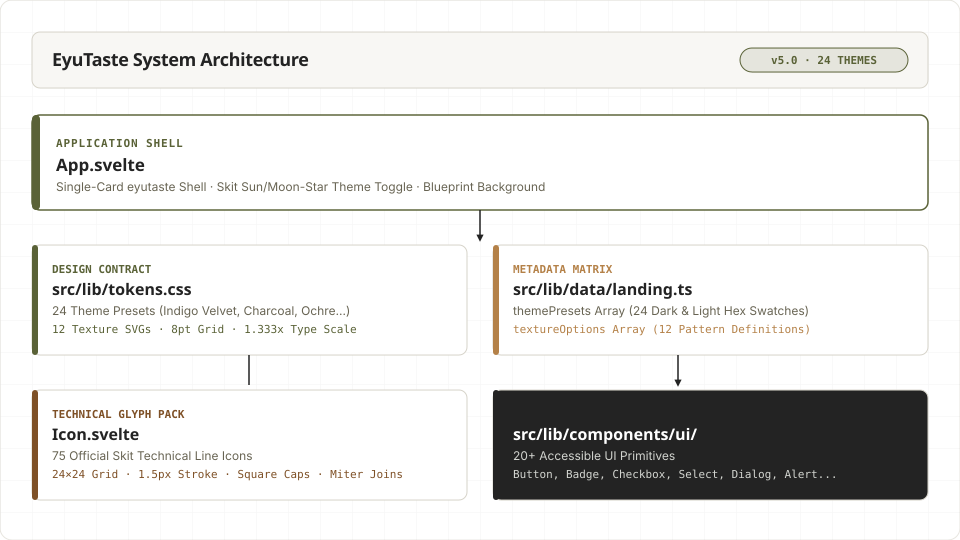

# EyuTaste (Inspired by Robi)

Svelte 5 design system for all Eyuel brand things. Premium indigo velvet & monochrome canvas, 24 custom colorways, 12 background texture patterns, sharp Skit technical icons, engineered typography.

## System Architecture



## Directory Structure

```
src/
  App.svelte            Page shell — minimal eyutaste card + theme toggle
  main.ts               Vite entry point
  lib/
    tokens.css          THE Contract — 24 theme colorways, 12 texture patterns, 8pt grid
    app.css             Base layout (.shell 1360px container), reset & utilities
    data/
      landing.ts        ThemePresets matrix (24 presets) & TextureOptions (12 patterns)
    components/
      primitives/       Icon.svelte (75 official Skit technical glyphs)
      ui/               Accessible UI components (Button, Badge, Input, Checkbox, Select...)
      sections/         Page sections (Hero, SiteHeader, SiteFooter, Bento, ThemeStudio, Styleguide)
      brand/            Brand mark identity
```

## System Rules

- **Tokens are the Contract**: Every color, shadow, space, and texture pattern resolves in `tokens.css`. No inline hex codes.
- **Skit Technical Icons**: All icons use the unified `Icon.svelte` primitive (24×24 grid, 1.5px stroke weight, square caps, miter joins).
- **24 Theme Presets**: Base Charcoal (`#232323`), Indigo Velvet (`#181826`), Cyber Olive, Solar Ochre, Terracotta Rust, Emerald Sage, Crimson Obsidian, Monochrome Slate, plus 16 additional complementary colorways.
- **Paired Dark & Light Modes**: Each theme features its own dedicated dark state and custom-tuned light canvas state (e.g., `indigo-velvet` dark cosmos / `indigo-velvet-light` soft lavender silk).
- **Composition, Not Inheritance**: Built using Svelte 5 runes (`$state`, `$derived`, `$props`), snippets, and clean state callbacks.

## Quick Start

```bash
# Start development server
npm run dev

# Production build
npm run build
```
